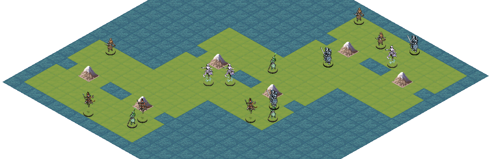

.. Stratega documentation master file, created by
   sphinx-quickstart on Tue Jan  5 10:31:27 2021.
   You can adapt this file completely to your liking, but it should at least
   contain the root `toctree` directive.

Stratega Docs
====================================

.. toctree::
   :hidden:

   self

.. toctree::
   :maxdepth: 1
   :caption: About

   about/introduction/index
   about/community/index

.. toctree::
   :maxdepth: 1
   :caption: Getting Started

   gettingStarted/installation/index

.. toctree::
   :maxdepth: 1
   :caption: Tutorials

   tutorials/firstStepsPython/index

   tutorials/implementAgent/index
   tutorials/implementOSLA/index   

   tutorials/exploringGameStates/index
   tutorials/definingANewGame/index
   tutorials/advancedAgents/index

.. toctree::
   :maxdepth: 1
   :caption: Structure

   structure/overview/index
   structure/representation/index
   structure/gameLogic/index
   structure/arena/index

.. toctree::
   :maxdepth: 1
   :caption: Games

   games/index

.. toctree::
   :maxdepth: 1
   :caption: Extra Information

   extraInformation/faq/index

.. toctree::
   :maxdepth: 2
   :caption: References

   references/YAML/index
   references/CPP/index
   references/PYTHON/index