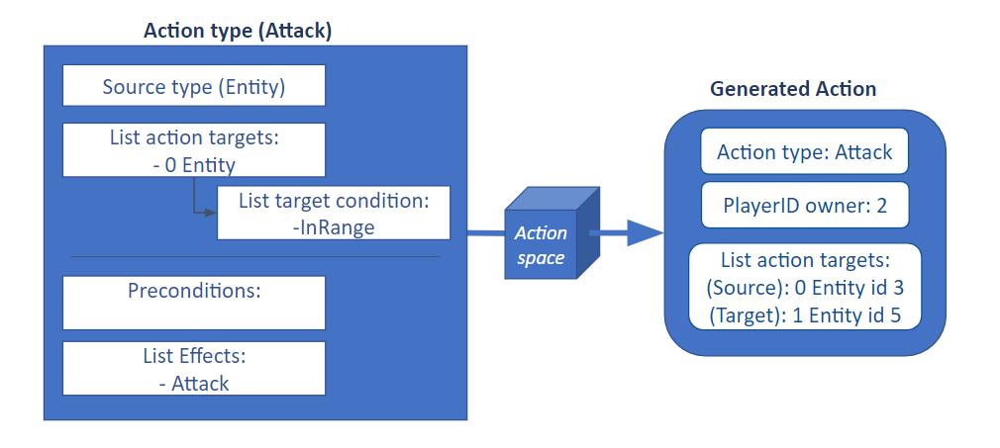

#############
Action
#############

To understand our actions, we need to know there are two classes related to them in Stratega.
The action type contains the definition of an action, which type is the source, a set effects, preconditions and a list of action targets types linked to their target conditions.
The action object contains the last tick this action was executed, the action type ID and a list of action targets that reference to existing data of the game.

As a summary, the action target defines how the actions affects the game and who are the involved type of targets (Players, entities, entitytype...), while the action is linked to a certain action type but is the one that contais list of exixting targets in the game.
