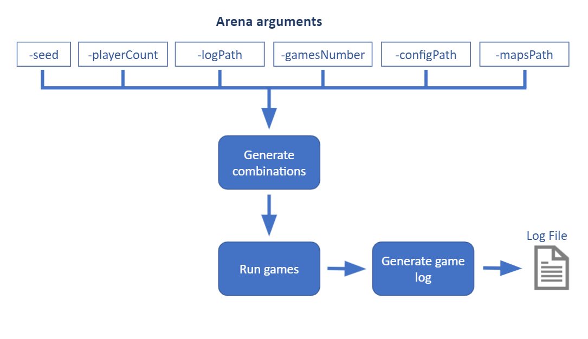
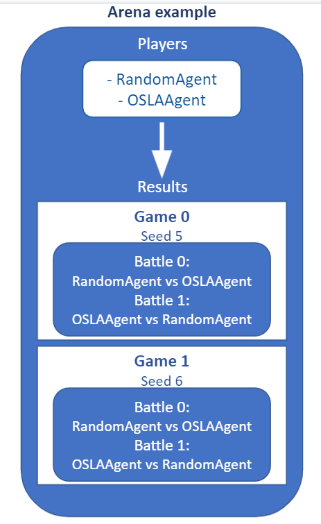
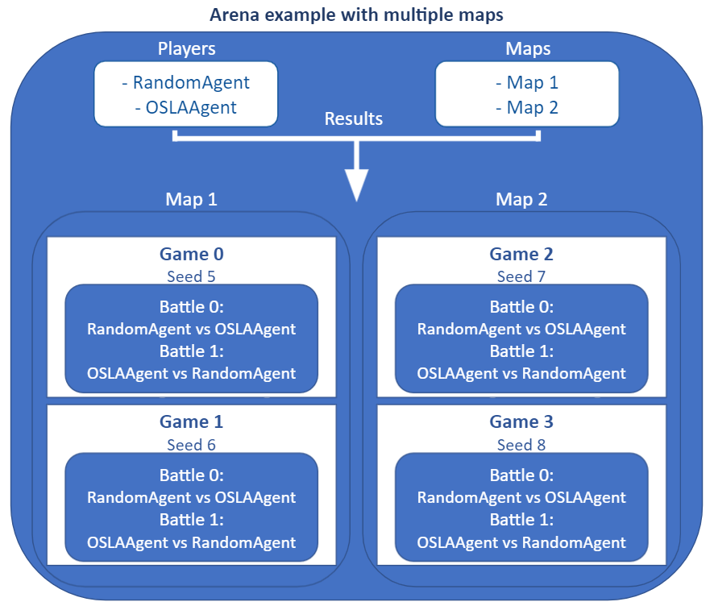

.. _arena:

#############
Arena
#############

After coding new agents and environments you maybe would wonder how to test them simply without rendering the game state and manually executing each game.

The Arena provides an easy way to test the performance between different Agents in different environments. 
It lets play a set of Agents versus each other while using the logging system it generates automatically a file with all the information about the game.

Arena flow
----------
An arena competition is a set of Games between two or more agents. 
Each Game consists of a certain number of battles, the number of battles depends on the number of possible permutations between the number of agents.
Each battle uses the same seed to generate the Gamestate.
In each permutation the agents order are swapped, this gives the possibility to let play the agents from all the different start positions. 

    **Permutation example:**

    Given the following list of three agents.

    Agents list:
        - MCTSAgent
        - RHEAAgent
        - RandomAgent

    The Arena will generate a list of combinations and run each combination using the same seed for each battle.

    Possible battles in a Game:
        - MCTSAgent vs RHEAAgent vs RandomAgent
        - MCTSAgent vs RandomAgent vs RHEAAgent
        - RHEAAgent vs MCTSAgent vs RandomAgent
        - RHEAAgent vs RandomAgent vs MCTSAgent
        - RandomAgent vs RHEAAgent vs MCTSAgent
        - RandomAgent vs MCTSAgent vs RHEAAgent

The Arena can be configured to play a certain number of Games resulting in faster testing.
Each game will increment the seed for obtaining different results while using the same battle configuration.
It is also possible to run a set of games on different maps.

Arena Arguments
----------------
The arena accepts multiple arguments to configure how the competition will take place.
Some of these are optional and Stratega already included a default value.

Arguments:

- **seed:** Used to initialize the random engine.
- **playerCount:** Defines the number of agents that will play the games.
- **logPath:** Path of the log file that Stratega will generate.
- **gamesNumber:** Allow the user to choose the number of games that agents will play.
- **configPath:** Path of the game configuration yaml.
- **mapsPath:** Allow the user to play all game combinations in a set of maps.

+------------+------------+------------------+
| Argument   | Optional   | Default value    |
+============+============+==================+
| seed       |    yes     |        0         |
+------------+------------+------------------+
| playerCount|    yes     |        2         |
+------------+------------+------------------+
| gamesNumber|    yes     |        2         |
+------------+------------+------------------+
| configPath |    no      | KillTheKing.yaml |
+------------+------------+------------------+
| mapsPath   |   yes      |        x         |
+------------+------------+------------------+
| logPath    |   yes      | ./sgaLog.yaml    |
+------------+------------+------------------+

Computation budget time
-----------------------
        
The arena can limit the computation and initialization time of the agents, these settings can be added to any game configuration.
If the agents exceed the budged time they will receive and warning, if the agent exceeds the number of warnings or the disqualification time will lose the battle.

.. code-block:: yaml
    :caption: Note that times are defined in milliseconds.

    GameRunner:
        AgentInitializationTime:
            Enabled: true
            BudgetTimeMs: 50
            DisqualificationTimeMs: 70
        AgentComputationTime:
            Enabled: true
            BudgetTimeMs: 50
            DisqualificationTimeMs: 70
            MaxNumberWarnings: 5

Single map
----------------

++++++++++++++++++++++++++++++++++++++++++
Generated log example using one single map
++++++++++++++++++++++++++++++++++++++++++
This example is the result of a competition between two agents(OSLAAgent and RandomAgent). In this competition they only played one game in one single map.

.. code-block:: yaml

    Game 0:
        Map: 0
        Battle: 0
        Seed: 0
        PlayerAssignment: [OSLAAgent, RandomAgent]
        ActivePlayer: [0, 0, 0, 0, 0, 0, 0, 0, 0, 0, 0, 0, 0, 0, 0, 0, 0, 0, 0, 0, 1, 1, 1, 1, 1, 1, 1, 1, 0, 0, 0, 0, 0, 0, 0, 0, 0, 0, 0, 0, 0, 0, 0, 0, 0, 0, 0, 1, 1, 1, 1, 1, 1, 1, 1, 0, 0, 0, 0, 0, 0, 0, 0, 0, 0, 0, 0, 0, 0, 0, 1, 1, 1, 1, 1, 0, 0]
        ActionCount: [55, 55, 50, 44, 44, 37, 33, 28, 25, 27, 22, 24, 25, 19, 17, 17, 10, 9, 8, 1, 61, 44, 46, 46, 32, 25, 20, 17, 51, 45, 48, 43, 37, 41, 36, 33, 28, 24, 24, 25, 25, 25, 20, 16, 14, 10, 1, 39, 26, 24, 16, 15, 8, 4, 3, 33, 30, 28, 22, 20, 14, 13, 13, 13, 13, 13, 8, 5, 6, 1, 22, 14, 6, 9, 3, 19, 13]
        WinnerID: 1
        Turns: 5
    Game 0:
        Map: 0
        Battle: 1
        Seed: 0
        PlayerAssignment: [RandomAgent, OSLAAgent]
        ActivePlayer: [0, 0, 0, 0, 0, 0, 0, 0, 0, 0, 0, 0, 0, 0, 0, 0, 0, 0, 0, 0, 1, 1, 1, 1, 1, 1, 1, 1, 1, 1, 1, 1, 1, 1, 1, 1, 1, 1, 1, 1, 1, 0, 0, 0, 1, 1, 1, 1, 1, 1, 1, 1, 1, 1, 1, 1, 1, 1, 1, 1, 1, 1, 1, 1, 1, 0, 0, 0, 0, 0, 0, 0, 0, 0, 0, 0, 0, 0, 0, 0, 0, 0, 0, 0, 0, 0, 1, 1, 1, 1, 1, 1, 1, 1, 1, 1, 0, 0, 0, 0, 0, 0, 0, 0, 0, 0, 0, 1, 1]
        ActionCount: [55, 49, 50, 45, 48, 49, 42, 35, 32, 30, 31, 30, 30, 24, 18, 10, 10, 10, 4, 1, 61, 55, 58, 50, 44, 42, 37, 33, 28, 25, 27, 24, 22, 23, 19, 17, 16, 10, 9, 8, 1, 60, 57, 55, 49, 43, 45, 41, 35, 37, 33, 28, 24, 19, 24, 19, 24, 19, 18, 15, 13, 11, 8, 4, 1, 61, 61, 53, 47, 45, 45, 40, 35, 36, 31, 25, 25, 24, 24, 19, 12, 9, 13, 11, 3, 1, 29, 25, 27, 24, 21, 16, 10, 8, 5, 1, 42, 45, 34, 31, 30, 21, 18, 18, 14, 3, 1, 13, 7]
        WinnerID: 0
        Turns: 5

Multiple maps
--------------------

If you want to run all the generated combinations in a set of different maps, you can use the argument **-mapsPath** to define the path of yaml file with all the maps.

Example of maps file:

.. code-block:: yaml

    Maps:
        Map1: |-
            M  M  M  M  M  M  M  M  M  M  M  M  M  M  M  M  M  M  M  M  M  M  M  M  M  M  M  M  M  M  M  M
            M  .  .  .  .  .  .  .  .  .  .  .  .  .  M  .  .  .  .  .  .  .  .  .  .  .  .  .  .  .  .  M
            M  .  .  .  .  .  .  .  .  W  .  .  .  .  .  .  .  .  .  .  .  .  .  .  .  .  .  .  .  .  .  M
            M  .  .  a1 .  .  .  .  .  W  .  .  .  .  .  .  .  .  .  .  .  .  .  .  .  .  .  .  .  .  .  M
            M  .  a1 k1 h1 .  .  .  .  W  W  .  .  .  .  .  .  .  .  .  .  .  .  .  .  .  .  .  .  .  .  M
            M  .  .  w1 w1 .  .  .  .  W  W  .  .  .  .  .  .  .  .  .  .  .  M  M  .  .  .  .  .  M  M  M
            M  .  .  .  .  .  .  .  .  .  W  W  W  W  .  .  .  .  .  .  .  .  W  W  W  W  W  W  W  W  W  W
            M  .  .  .  .  .  .  .  .  .  W  W  W  W  .  .  .  .  .  .  .  .  W  W  W  W  W  W  W  W  W  W
            M  M  M  .  .  .  .  .  .  .  .  .  W  W  W  W  W  W  W  W  W  W  W  W  W  W  W  W  W  W  W  W
            M  .  .  .  .  .  .  .  .  .  .  .  .  W  W  W  W  W  W  W  W  W  W  W  W  W  W  W  W  W  W  W
            M  .  .  .  .  .  .  M  M  M  M  M  M  M  M  M  M  M  M  M  M  M  M  M  M  M  .  W  W  W  W  W
            M  M  M  .  .  .  .  .  .  .  .  .  .  .  .  .  .  .  .  .  .  .  .  .  .  .  .  W  W  W  W  W
            M  .  .  .  .  .  .  .  .  .  .  .  .  .  .  .  .  .  .  .  .  .  .  .  a0 .  .  .  .  .  .  M
            M  .  .  .  .  .  .  .  .  .  .  .  .  .  .  .  .  .  .  .  .  .  .  a0 k0 h0 .  .  .  .  .  M
            M  M  M  .  .  .  .  .  .  .  .  .  .  .  .  .  .  .  .  .  .  .  .  .  w0 w0 .  .  .  .  .  M
            M  .  .  .  .  .  .  .  .  .  .  .  .  .  .  .  .  .  .  .  .  .  .  .  .  .  .  .  .  .  .  M
            M  M  M  M  M  M  M  M  M  M  M  M  M  M  M  M  M  M  M  M  M  M  M  M  M  M  M  M  M  M  M  M

        Map2: |-
            M  M  M  M  M  M  M  M  M  M  M  M  M  M  M  M  M  M  M  M  M  M  M  M  M  M  M  M  M  M  M  M
            M  .  .  .  .  .  .  .  .  .  .  .  .  .  M  .  .  .  .  .  .  .  .  .  .  .  .  .  .  .  .  M
            M  .  .  .  .  .  .  .  .  .  .  .  .  .  .  .  .  .  .  .  .  .  .  .  .  .  .  .  .  .  .  M
            M  .  .  a1 .  .  .  .  .  .  .  .  .  .  .  .  .  .  .  .  .  .  .  .  .  .  .  .  .  .  .  M
            M  .  a1 k1 h1 .  .  .  .  .  .  .  .  .  .  .  .  .  .  .  .  .  .  .  .  .  .  .  .  .  .  M
            M  .  .  w1 w1 .  .  .  .  .  .  .  .  .  .  .  .  .  .  .  .  .  M  M  .  .  .  .  .  M  M  M
            M  .  .  .  .  .  .  .  .  .  .  .  .  .  .  .  .  .  .  .  .  .  W  W  W  W  W  W  W  W  W  W
            M  .  .  .  .  .  .  .  .  .  .  .  .  .  .  .  .  .  .  .  .  .  W  W  W  W  W  W  W  W  W  W
            M  M  M  .  .  .  .  .  .  .  .  .  .  .  .  .  .  .  .  .  .  .  W  W  W  W  W  W  W  W  W  W
            M  .  .  .  .  .  .  .  .  .  .  .  .  .  .  .  .  .  .  .  .  .  W  W  W  W  W  W  W  W  W  W
            M  .  .  .  .  .  .  .  .  .  .  .  .  .  .  .  .  .  .  .  .  .  .  .  .  .  .  W  W  W  W  W
            M  M  M  .  .  .  .  .  .  .  .  .  .  .  .  .  .  .  .  .  .  .  .  .  .  .  .  W  W  W  W  W
            M  .  .  .  .  .  .  .  .  .  .  .  .  .  .  .  .  .  .  .  .  .  .  .  a0 .  .  .  .  .  .  M
            M  .  .  .  .  .  .  .  .  .  .  .  .  .  .  .  .  .  .  .  .  .  .  a0 k0 h0 .  .  .  .  .  M
            M  M  M  .  .  .  .  .  .  .  .  .  .  .  .  .  .  .  .  .  .  .  .  .  w0 w0 .  .  .  .  .  M
            M  .  .  .  .  .  .  .  .  .  .  .  .  .  .  .  .  .  .  .  .  .  .  .  .  .  .  .  .  .  .  M
            M  M  M  M  M  M  M  M  M  M  M  M  M  M  M  M  M  M  M  M  M  M  M  M  M  M  M  M  M  M  M  M

        Map3: |-
            M  M  M  M  M  M  M  M  M  M  M  M  M  M  M  M  M  M  M  M  M  M  M  M  M  M  M  M  M  M  M  M
            M  .  .  .  .  .  .  .  .  .  .  .  .  .  M  .  .  .  .  .  .  .  .  .  .  .  .  .  .  .  .  M
            M  .  .  .  .  .  .  .  .  .  .  .  .  .  .  .  .  .  .  .  .  .  .  .  .  .  .  .  .  .  .  M
            M  .  .  a1 .  .  .  .  .  .  .  .  .  .  .  .  .  .  .  .  .  .  .  .  .  .  .  .  .  .  .  M
            M  .  a1 k1 h1 .  .  .  .  .  .  .  .  .  .  .  .  .  .  .  .  .  .  .  .  .  .  .  .  .  .  M
            M  .  .  w1 w1 .  .  .  .  .  .  .  .  .  .  .  .  .  .  .  .  .  M  M  .  .  .  .  .  M  M  M
            M  .  .  .  .  .  .  .  .  .  .  .  .  .  .  .  .  .  .  .  .  .  W  W  W  W  W  W  W  W  W  W
            M  .  .  .  .  .  M  M  M  M  M  M  M  M  .  .  .  .  .  .  .  .  W  W  W  W  W  W  W  W  W  W
            M  M  M  .  .  .  M  M  M  M  M  M  M  M  .  .  .  .  .  .  .  .  W  W  W  W  W  W  W  W  W  W
            M  .  .  .  .  .  M  M  M  M  M  M  M  M  .  .  .  .  .  .  .  .  W  W  W  W  W  W  W  W  W  W
            M  .  .  .  .  .  M  M  M  M  M  M  M  M  .  .  .  .  .  .  .  .  .  .  .  .  .  W  W  W  W  W
            M  M  M  .  .  .  M  M  M  M  M  M  M  M  .  .  .  .  .  .  .  .  .  .  .  .  .  W  W  W  W  W
            M  .  .  .  .  .  M  M  M  M  M  M  M  M  .  .  .  .  .  .  .  .  .  .  a0 .  .  .  .  .  .  M
            M  .  .  .  .  .  M  M  M  M  M  M  M  M  .  .  .  .  .  .  .  .  .  a0 k0 h0 .  .  .  .  .  M
            M  M  M  .  .  .  M  M  M  M  M  M  M  M  .  .  .  .  .  .  .  .  .  .  w0 w0 .  .  .  .  .  M
            M  .  .  .  .  .  M  M  M  M  M  M  M  M  .  .  .  .  .  .  .  .  .  .  .  .  .  .  .  .  .  M
            M  M  M  M  M  M  M  M  M  M  M  M  M  M  M  M  M  M  M  M  M  M  M  M  M  M  M  M  M  M  M  M
    

++++++++++++++++++++++++++++++++++++++++++
Generated log example using multiple maps
++++++++++++++++++++++++++++++++++++++++++
This example is the result of a competition between two agents(OSLAAgent and RandomAgent). In this competition they played only one game on three different maps.

.. code-block:: yaml

    Game 0:
        Map: 0
        Battle: 0
        Seed: 0
        PlayerAssignment: [OSLAAgent, RandomAgent]
        ActivePlayer: [0, 0, 0, 0, 0, 0, 0, 0, 0, 0, 0, 0, 0, 0, 0, 0, 0, 0, 0, 0, 1, 1, 1, 1, 1, 1, 1, 1, 0, 0, 0, 0, 0, 0, 0, 0, 0, 0, 0, 0, 0, 0, 0, 0, 0, 0, 0, 1, 1, 1, 1, 1, 1, 1, 1, 0, 0, 0, 0, 0, 0, 0, 0, 0, 0, 0, 0, 0, 0, 0, 1, 1, 1, 1, 1, 0, 0]
        ActionCount: [55, 55, 50, 44, 44, 37, 33, 28, 25, 27, 22, 24, 25, 19, 17, 17, 10, 9, 8, 1, 61, 44, 46, 46, 32, 25, 20, 17, 51, 45, 48, 43, 37, 41, 36, 33, 28, 24, 24, 25, 25, 25, 20, 16, 14, 10, 1, 39, 26, 24, 16, 15, 8, 4, 3, 33, 30, 28, 22, 20, 14, 13, 13, 13, 13, 13, 8, 5, 6, 1, 22, 14, 6, 9, 3, 19, 13]
        WinnerID: 1
        Turns: 5
    Game 0:
        Map: 0
        Battle: 1
        Seed: 0
        PlayerAssignment: [RandomAgent, OSLAAgent]
        ActivePlayer: [0, 0, 0, 0, 0, 0, 0, 0, 0, 0, 0, 0, 0, 0, 0, 0, 0, 0, 0, 0, 1, 1, 1, 1, 1, 1, 1, 1, 1, 1, 1, 1, 1, 1, 1, 1, 1, 1, 1, 1, 1, 0, 0, 0, 1, 1, 1, 1, 1, 1, 1, 1, 1, 1, 1, 1, 1, 1, 1, 1, 1, 1, 1, 1, 1, 0, 0, 0, 0, 0, 0, 0, 0, 0, 0, 0, 0, 0, 0, 0, 0, 0, 0, 0, 0, 0, 1, 1, 1, 1, 1, 1, 1, 1, 1, 1, 0, 0, 0, 0, 0, 0, 0, 0, 0, 0, 0, 1, 1]
        ActionCount: [55, 49, 50, 45, 48, 49, 42, 35, 32, 30, 31, 30, 30, 24, 18, 10, 10, 10, 4, 1, 61, 55, 58, 50, 44, 42, 37, 33, 28, 25, 27, 24, 22, 23, 19, 17, 16, 10, 9, 8, 1, 60, 57, 55, 49, 43, 45, 41, 35, 37, 33, 28, 24, 19, 24, 19, 24, 19, 18, 15, 13, 11, 8, 4, 1, 61, 61, 53, 47, 45, 45, 40, 35, 36, 31, 25, 25, 24, 24, 19, 12, 9, 13, 11, 3, 1, 29, 25, 27, 24, 21, 16, 10, 8, 5, 1, 42, 45, 34, 31, 30, 21, 18, 18, 14, 3, 1, 13, 7]
        WinnerID: 0
        Turns: 5
    Game 1:
        Map: 1
        Battle: 0
        Seed: 1
        PlayerAssignment: [OSLAAgent, RandomAgent]
        ActivePlayer: [0, 0, 0, 0, 0, 0, 0, 0, 0, 0, 0, 0, 0, 0, 0, 0, 0, 0, 0, 0, 1, 1, 1, 1, 1, 1, 1, 1, 1, 1, 1, 1, 1, 1, 1, 1, 1, 1, 1, 0, 0, 0, 0, 0, 0, 0, 0, 0, 0, 0, 0, 0, 0, 0, 0, 0, 0, 0, 1, 1, 1, 1, 1, 1, 1, 1, 1, 1, 1, 1, 1, 1, 1, 0, 0, 0, 0, 0, 0, 0, 0]
        ActionCount: [55, 58, 50, 44, 45, 37, 33, 28, 25, 27, 25, 24, 24, 19, 17, 17, 10, 9, 8, 1, 61, 55, 44, 47, 41, 40, 32, 33, 26, 28, 25, 26, 17, 12, 11, 11, 3, 2, 1, 61, 55, 55, 50, 44, 44, 37, 34, 28, 25, 25, 27, 27, 27, 19, 16, 17, 10, 1, 39, 37, 36, 33, 26, 26, 20, 20, 20, 20, 18, 10, 10, 2, 1, 50, 46, 47, 39, 35, 36, 28, 19]
        WinnerID: 1
        Turns: 4
    Game 1:
        Map: 1
        Battle: 1
        Seed: 1
        PlayerAssignment: [RandomAgent, OSLAAgent]
        ActivePlayer: [0, 0, 0, 0, 0, 0, 0, 0, 0, 0, 0, 0, 0, 0, 0, 1, 1, 1, 1, 1, 1, 1, 1, 1, 1, 1, 1, 1, 1, 1, 1, 1, 1, 1, 1, 1, 0, 0, 0, 0, 0, 0, 0, 0, 0, 0, 0, 0, 1, 1, 1, 1, 1, 1, 1, 1, 1, 1, 1, 1, 1, 1, 1, 1, 1, 1, 1, 1, 1, 0, 0, 0, 0, 0, 0, 0, 0, 0, 0, 1, 1, 1, 1, 1, 1, 1, 1, 1, 1, 0, 0, 0, 0, 0, 0, 0, 1, 1]
        ActionCount: [55, 39, 34, 38, 39, 35, 36, 29, 29, 22, 17, 15, 17, 15, 9, 61, 55, 58, 50, 44, 42, 37, 33, 28, 25, 27, 24, 22, 23, 19, 17, 16, 10, 9, 8, 1, 43, 41, 36, 30, 30, 30, 31, 26, 26, 26, 18, 19, 49, 43, 45, 41, 35, 37, 33, 28, 24, 19, 24, 19, 24, 19, 18, 15, 13, 11, 8, 4, 1, 41, 37, 32, 27, 30, 30, 20, 12, 11, 4, 29, 25, 27, 24, 21, 16, 10, 8, 5, 1, 25, 26, 18, 10, 8, 7, 6, 13, 7]
        WinnerID: 0
        Turns: 5
    Game 2:
        Map: 2
        Battle: 0
        Seed: 2
        PlayerAssignment: [OSLAAgent, RandomAgent]
        ActivePlayer: [0, 0, 0, 0, 0, 0, 0, 0, 0, 0, 0, 0, 0, 0, 0, 0, 0, 0, 0, 0, 1, 1, 1, 1, 1, 1, 1, 1, 1, 1, 1, 0, 0, 0, 0, 0, 0, 0, 0, 0, 0, 0, 0, 0, 0, 0, 0, 0, 0, 0, 1, 1, 1, 1, 1, 1, 1, 1, 1, 1, 1, 1, 1, 1, 1, 1, 1, 1, 0, 0, 0, 0, 0, 0, 0, 0]
        ActionCount: [55, 58, 50, 44, 45, 37, 33, 28, 25, 27, 25, 24, 24, 19, 17, 17, 10, 9, 8, 1, 61, 55, 57, 46, 38, 39, 40, 37, 31, 31, 25, 61, 55, 55, 50, 44, 44, 37, 34, 28, 25, 25, 27, 27, 27, 19, 16, 17, 10, 1, 47, 47, 44, 43, 44, 38, 40, 30, 28, 23, 16, 17, 16, 17, 11, 9, 8, 1, 50, 46, 47, 39, 35, 36, 28, 19]
        WinnerID: 1
        Turns: 4
    Game 2:
        Map: 2
        Battle: 1
        Seed: 2
        PlayerAssignment: [RandomAgent, OSLAAgent]
        ActivePlayer: [0, 0, 0, 0, 0, 0, 0, 0, 0, 0, 0, 0, 0, 0, 0, 0, 0, 0, 0, 0, 1, 1, 1, 1, 1, 1, 1, 1, 1, 1, 1, 1, 1, 1, 1, 1, 1, 1, 1, 1, 1, 0, 0, 0, 0, 0, 0, 0, 0, 0, 0, 0, 0, 0, 0, 0, 0, 1, 1, 1, 1, 1, 1, 1, 1, 1, 1, 1, 1, 1, 1, 1, 1, 1, 1, 1, 1, 1, 0, 0, 0, 0, 0, 0, 0, 1, 1, 1, 1, 1, 1, 1, 1, 1, 1, 0, 0, 0, 0, 0, 0, 0, 0, 0, 0, 0, 0, 1, 1]
        ActionCount: [58, 52, 54, 48, 46, 43, 39, 37, 36, 28, 23, 17, 14, 11, 10, 13, 12, 12, 5, 1, 61, 55, 58, 50, 44, 42, 37, 33, 28, 25, 27, 24, 22, 23, 19, 17, 16, 10, 9, 8, 1, 54, 51, 40, 43, 43, 40, 32, 30, 26, 20, 16, 15, 7, 6, 9, 1, 49, 43, 45, 41, 35, 37, 33, 28, 24, 19, 24, 19, 24, 19, 18, 15, 13, 11, 8, 4, 1, 35, 37, 40, 31, 29, 22, 18, 29, 25, 27, 24, 21, 16, 10, 8, 5, 1, 37, 33, 24, 23, 16, 11, 11, 10, 8, 9, 9, 8, 13, 7]
        WinnerID: 0
        Turns: 5
