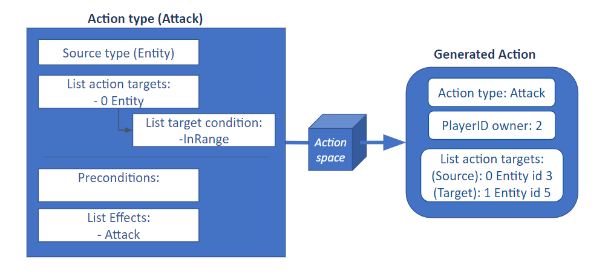

###############################
Game Logic
###############################
Since Stratega allows the user to configure a wide range of games, we have to provide a way to define the game rules.
This page will give an overview of how actions and the forward model work.
We also include some snippets to show how this works in practice.

++++++++++++++++++++++++++++++++
Actions
++++++++++++++++++++++++++++++++
When defining an action in Stratega, you actually define the action type.
The action type describes who can execute the action, what it can target, and what happens if it is executed.
Once we have the full definition of an action type, we can use it to generate all actions of this type from a given game state.
Below you can see a diagram that shows how this looks like.

Of course, generating actions is not that simple, but the most essential part of this is the definition of the targets.
When defining a single target in the action type, you describe all valid possible targets.
That means even though the **action** will only target one element, the **action type** has to describe all possible targets.
Thus, for each valid target found in a game state, Stratega will generate one action.

It is also possible to define multiple targets per action type, but they cannot depend on each other.
So, for example, if you want to spawn an entity, you can target a position and an entity type to spawn.
But it's not possible to target a position and then an entity in range of that position.
This is due to performance issues.
Since action targets cannot depend on each other, we can generate all actions by taking the cross-product of all elements in the list of targets.

Now that we've discussed how Stratega generates actions let's discuss how they are executed.
Currently, Stratega supports two types of actions, entity actions and player actions.
As the names indicate, entities can execute entity actions, while the other type is for players.
The only real difference between the two action types is the source target that Stratega will generate.
As mentioned before, actions can target various things, but they will always contain a source-target by default.
For entity actions, the source-target contains the entity which executes the action.
This is also true for player actions, just that the source-target contains the executing player.

Once an agent decides to execute an action, Stratega will go over all the effects defined in the action type and execute them in order.
Effects consist of a list of commands that are provided by Stratega.
Thus, all you have to define is the parameters that the command should use.
To provide these parameters, we have access to all the targets defined beforehand.
So, for example, if we defined an entity as a target, we can execute an effect that removes that entity.
But we can do much more!
Since entities contain various parameters, we can also access them directly.

Below you can see a snippet containing the definition of an action.
For example, we can see that we defined a target called "AttackTarget" and an effect that modifies the health of the AttackTarget, this is done by using "AttackTarget.Health".

.. code-block:: yaml

    Attack:
        Type: EntityAction
        Cooldown: 1
        Targets:
            AttackTarget:
                Type: Entity
                ValidTargets: [Warrior, Archer]
                Conditions:
                    - "InRange(Source, AttackTarget, Source.Range)"
        Effects:
            - "Attack(AttackTarget.Health, Source.WeaponStrength)"

As a summary, the action type defines an action in Stratega.
Action targets describe a list of valid targets and are used to generate actions from a given game state.
Each action type has a default source type that describes who an action can be attached to.
When executing an action, a list of effects describes how an action affects the game state.
Each effect has a list of parameters that depend on the previously defined targets. 

++++++++++++++++++++++++++++++++
Forward Model
++++++++++++++++++++++++++++++++

The forward model is the driving component of this framework.
You can provide it with a game state, and it generates all available actions using the previously described mechanics.
It is also possible to switch out the action space to modify which actions the forward model should return.
The returned actions contain a reference to the action type, the targets and who executes the action.
For additional information, the action type has to be inspected.

Of course, the primary responsibility of the forward model is to advance a given game state.
Thus, if you provide the forward model with an action and a game-state, it will update the game based on all the rules defined in the game.
This includes executing the effects defined in the action type. 

In the forward model, we can define lose- and win-conditions.
When the lose-condition becomes true, the corresponding player loses the game and can no longer contribute to the game.
Note, in a game with more than 2 players, the game will still continue.
Meanwhile, a win-condition will automatically end the game and declare the corresponding player as the winner.
All other players are ranked second.
Conditions are evaluated by providing them with a single source target.
In this case, the source is the player that needs to be checked.
That is why each condition has access to a source in the given example below.

.. code-block:: yaml
                   
    ForwardModel:
        LoseConditions:
            HasNoCity:
              - "HasNoEntity(Source, City)" # A player loses the game if he has no entity of type City anymore

        Trigger:
            - OnTick:
                ValidTargets: City
                Conditions:
                    - "IsPlayerEntity(Source)"
                Effects:
                    - "ModifyResource(Source.Player.Gold, 1)"

Additional flexibility is achieved by the use of triggers and effects.
Given an event, e.g. a unit entering a cell or a player ending a turn, the forward model can execute subscribed methods.
This can be used to implement game-mechanics such as a unit losing health at the end of each turn.
In the given example, we used it to generate one gold for each city a player owns.
Alternatively, it allows to log information every time an event occurs.