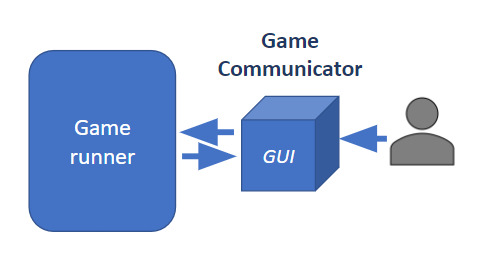

#############
GUI
#############

The GUI inherits from GameCommunicator and is in charge of drawing the current game state. 
Run on its own thread and is completely detached from Stratega, if it has a played assigned the human player can play via GUI. 
It provides utilities for easier control.

.. list-table::
   :class: renderer-gallery

   *  -  **RTS**

         .. image:: ../../images/rtsGUI.png
            :width: 400

         RTS renderer.
      -  **TBS**

         .. image:: ../../images/tbsGUI.png
            :width: 400

         TBS renderer.