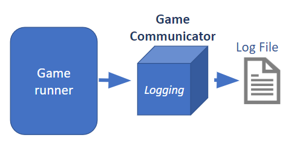

#############
Logging system
#############

Stratega implements a simple mechanism for logging results into yaml files. Automatic logging is achieved by using Game Communicators.

++++++++++++++++++++
Log example file
++++++++++++++++++++
.. code-block:: yaml

    Game:
        PlayerAssignment: [RandomAgent, RHEAAgent]
        ActivePlayer: [0, 0, 0, 0, 0, 0, 1, 1, 1, 1, 1, 0, 0, 0, 0, 0, 1, 1, 1, 1, 1, 1, 0, 0, 0, 0, 0, 0, 0, 1, 1, 1, 0, 0, 0, 0, 0, 1, 1, 0, 0, 0, 1, 1, 1, 1, 1, 1, 1, 1, 1, 1, 0, 0, 0, 0, 0, 0, 1, 1, 1, 1, 1, 1, 1, 1, 1, 1, 0, 0, 1, 1, 1, 1, 1, 1, 1, 1]
        ActionCount: [31, 27, 16, 4, 3, 2, 55, 54, 42, 17, 5, 91, 31, 19, 7, 6, 72, 29, 17, 6, 2, 1, 88, 31, 27, 26, 13, 2, 1, 70, 30, 18, 91, 30, 26, 16, 4, 75, 31, 28, 17, 16, 71, 59, 19, 7, 4, 3, 2, 2, 2, 1, 28, 18, 7, 6, 3, 1, 74, 31, 30, 28, 16, 14, 14, 14, 13, 1, 16, 6, 85, 30, 29, 17, 6, 5, 5, 2]
        WinnerID: 1
        Turns: 7
