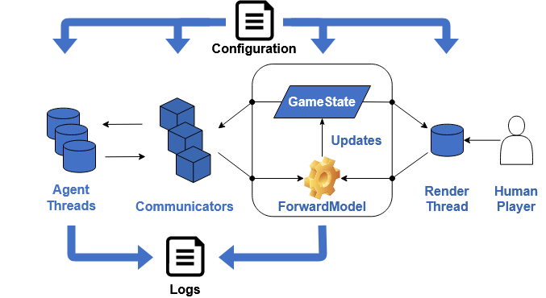

#############
Overview
#############

The Stratega framework mainly consists of 4 parts, i.e. the game-runner, rendering, agents, and configuration.

The core of the framework is the game-runner, whose sole purpose is to run games and provide information about the game. The framework provides two game-runners, one for turn-based and one for RTS-games.
The agents are responsible for controlling the actions of a player in the game state. 
To do this, each agent receives a game communicator to send actions or poll information about the current game state. Additionally, each agent has access to a copy of the forward model of the game-runner.
Regardless of the type of game, every agent-thread runs until the game is over. Agents can query information or send actions at any point in time, even during an opponent's turn. This enables agents to think outside their own turns. Additionally, the agent can observe how the game evolves to think ahead. Note that the turn-based game-runner ignores actions from players when it's not their turn. Meanwhile, the RTS-runner will collect the actions from all players and execute them in order of receipt after a set amount of time.

The runner keeps track of which agent controls which player in the game state. If no agent is available for a player, the runner will send a signal and wait until an external source provides the missing actions. 
The render-thread subscribes to events from the game-runner to update the window. If the runner signals missing agents, the GUI will switch to interactive mode to let human-players play the game. That also has the added benefit that human-players have no time limit.
This approach has similarities to MVVM, in the sense that the game-runner represents the view-model. The renderer (view) is decoupled from the logic and can be easily disabled to switch between headless-execution and GUI-execution.

A feature of the framework is the ability to write algorithms for various degrees of game-abstractions. While game-states represent nodes in a game-tree, the forward model represents the edges to get from one node to another. That means the forward model provides actions, as well as the game-logic.
Developers can provide a new forward model for the default game state or provide their new representations. Algorithms implemented in the framework can work with any kind of forward model.

Lastly, the framework provides the ability to configure games via YAML-files, which are explained in more detail in upcoming sections. It's noteworthy that configuration is separated from the rest of the framework, meaning the configuration initializes and sets up the game, but the framework does not need to be re-compiled every time a change in the configuration is made. 
