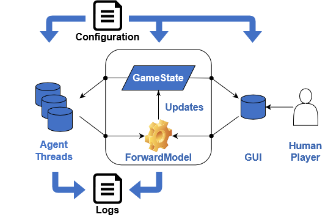

#############
Overview
#############

This page presents an overview of the various components contained in Stratega.
Stratega can be split roughly into 4 parts:

#. The Game Runner, 
#. The Agents,
#. The Game Renderer,
#. The Game Configuration.

The diagram below shows how these components interact with each other.
The **Game Runner** is represented by the box containing the forward model and game state.

The center of the framework is the game-runner, whose sole purpose is to run games.
Since Stratega supports both turn-based games and real-time games, the game-runner implements different behaviours based on the type of the game.
To actually run a game, the game-runner counts on the current state of the game and a forward model:

#. The **Game State** contains game data, without concerning about any logic. The structure of the game state is the same for all game types.
#. The **Forward Model** is used by the game-runner to update the state of the game whenever it receives a new set of actions. This forward model is implemented differently to suit each type of game. 

In order to run games, the game-runner needs access to the players who decide how to act in the game. Hence the game-runner also gets access to a list of **Agents**.
Whenever a player can act in the game, the game-runner will ask the corresponding agent to compute an action.
To do that, the agent gets access to a copy of the game state (with the corresponding fog of war) and the forward model. These players act differently depending on the type of game:

#. In *turn-based* strategy games, only one player can act simultaneously, so only one agent will be asked to compute an action.
#. In *real-time* strategy games, all agents can act in parallel, so they run in separate threads to save time.

The game-runner can be executed:
#. In a headless mode to evaluate games in quick succession.
#. With a graphical user interface (GUI) that allows the user to see and/or play the game. 

By default, the GUI will be in spectator mode, but if one of the agents passed to the game-runner is *nullptr*, it will be controllable by a human player. The GUI requires a  **Game Renderer**. The game-renderer is continuously informed about the current game state, which is then displayed to the user.

Finally the framework provides the ability to configure games using YAML files. The **Game Configuration** (GameConfig) is used to generate everything that was discussed so far, including what is contained in the game state, the game rules used by the forward model, and default agents that should be used in the game.
The main benefit of the configuration file is that it allows researchers to test agents on a wide range of games without changing the code and compiling new agents or the whole framework.
