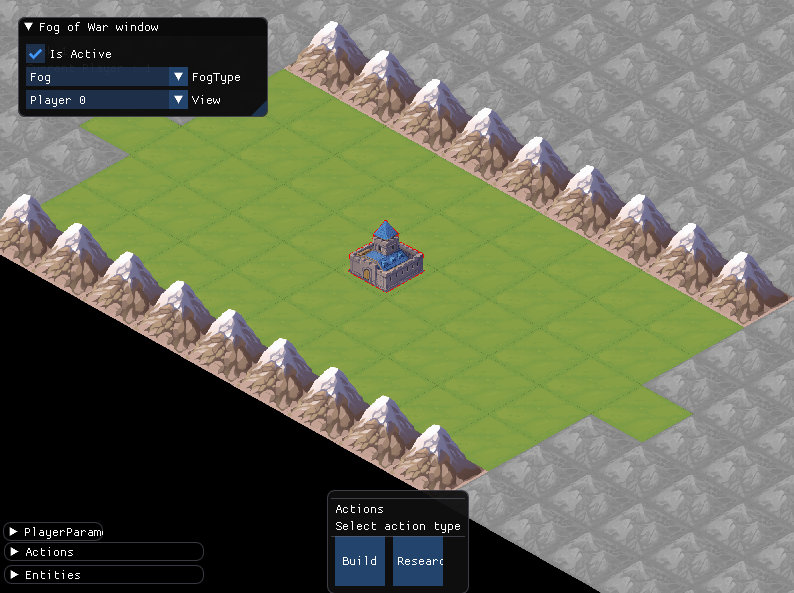

.. _agent_game_states:

.. role:: cpp(code)
   :language: c++

################################
Agents and Game States: Samples
################################

.. note::
    This page is about **programming** for Stratega. You are in the right place if you want to know how to write code about querying aspects of the game state and information. 

AI Agents have access to the current game state in order to be able to determine what is the best next action to execute in the game. This page shows a few examples about how to
access interesting information in the game state that can help you implement agents for this framework. Stratega supplies information in two different modalities:

#. Static information: this is information about the game as it is defined. This information doesn't change from state to state - i.e. it's information about the game rules.
#. Dynamic information: includes all the elements of the game state, that changes from one instantiation of the game to another. Examples are the presence of units, buildings, player parameter values and technologies researched. 

Given that Stratega supports multiple games (defined via YAML files), the *static* information is useful for creating agents that can include domain knowledge for multiple games, or to train
agents that behave differently depending on the characteristics of the game being played. The *dynamic* information is, however, useful for decision making in a state to state basis and, with
the functionality of the forward model, permits the implementation of model-based and/or sampling agents.

This page shows examples of how agents can access this information. For a more lengthy description of the elements of the game state and its representation, see 
:ref:`Game State Representation <game-state-representation>`.

++++++++++++++++
Game Information
++++++++++++++++

.. note::
    Game Information refers to **static** information of a game being played in Stratega. You are in the right place if you want to know how to write
    code about querying aspects that are constant during the duration of the game (i.e. types of units, types of tiles, technologies defined...). 

First of all, the YAML description file of the game being played is accessible to the agents at all times. You can retrieve the filename and parse the YAML file yourself. For instance, 
like this:

.. tabs::

    .. code-tab:: c++

        std::string yamlPath = state.getGameInfo()->getYAMLPath();
        std::ifstream infile(yamlPath);
        std::string line;
        while (std::getline(infile, line))
        {
            // Each iteration is a 'line' in the YAML file.
        }

    .. code-tab:: py

        yaml_path=state.get_game_info().get_yaml_path()
        yaml=open(yaml_path, "r")
        lines = yaml.readlines()
        for line in lines:
            print(line)

    

Note that 'state' in line 1 is the object of type 'GameState' which is (for instance) received in the function *computeAgent*. The property gameInfo in the game state is in charge of
providing static information about the game. See section :ref:`Game Info <game-state-representation_gameInfo>` for more details.

Game Description: Types
***********************

GameInfo's API provides information about the types of objects that can be found in the game. In particular, you can find information about possible types of tiles that form the board, 
entities and actions. These types can be accessed directly in their data structure (3 unordered maps, respectively, indexed by unique type ID) or by supplying a specific ID for the type.
The following code snippet shows how to access these maps and prints the name of the different elements in the game:

.. tabs::

    .. code-tab:: c++

		auto entityTypes = state.getGameInfo()->getEntityTypes();
		for (const auto& [id, eType] : entityTypes)
			std::cout << "[Entity] id: " << id << ", name: " << eType.getName() << std::endl;

		auto tileTypes = state.getGameInfo()->getTileTypes();
		for (const auto& [id, tType] : tileTypes)
			std::cout << "[Tile] id: " <<  id << ", name: " << tType.getName() << std::endl;

		auto actionTypes = state.getGameInfo()->getActionTypes();
		for (const auto& [id, aType] : actionTypes)
			std::cout << "[Action] id: " << id << ", name: " << aType.getName() << std::endl;

    .. code-tab:: py
        
        entity_types = state.get_game_info().get_entity_types()
        for id, eType in entity_types.items():
            print("[Entity] id:", id, "name", eType.get_name())

        tile_types = state.get_game_info().get_tile_types()
        for id, tType in tile_types.items():
            print("[Tile] id:", id, "name", tType.get_name())

        action_types = state.get_game_info().get_action_types()
        for id, aType in action_types.items():
            print("[Action] id:", id, "name", aType.get_name())

This code produces the following output for the game 'KillTheKing': 

.. code-block:: c++

    [Entity] id: 0, name: Archer
    [Entity] id: 1, name: Healer
    [Entity] id: 2, name: King
    [Entity] id: 3, name: Warrior
    [Tile] id: -1, name: FogOfWar
    [Tile] id: 0, name: Forest
    [Tile] id: 1, name: Mountain
    [Tile] id: 2, name: Plain
    [Tile] id: 3, name: Water
    [Action] id: 0, name: Attack
    [Action] id: 1, name: Heal
    [Action] id: 2, name: Move

All these *type* classes have information about the entities, tiles and actions they represent, such as:

#. `EntityType.h <https://github.com/GAIGResearch/Stratega/blob/dev/src/stratega/include/Stratega/Representation/EntityType.h>`_: Spawn/Build requirements, spawn costs, line of sights and actions that can be executed by this entity.
#. `TileType.h <https://github.com/GAIGResearch/Stratega/blob/dev/src/stratega/include/Stratega/Representation/TileType.h>`_: Properties of the tile, such as if it's walkable or blocks the line of sight.
#. `ActionType.h <https://github.com/GAIGResearch/Stratega/blob/dev/src/stratega/include/Stratega/ForwardModel/ActionType.h>`_: Action source (player or entity), preconditions for the action to take place, list of effects and action targets.

You're encouraged to look at the :ref:`cpp Reference <cpp-reference>` for variables and methods that can be used to retrieve this information.

Game Description: Categories
****************************

The GameInfo object also provides extra (static) information about the game through a GameDescription pointer, which provides additional details on the game's ontology. Stratega defines
a collection of entity and action groups that allows the agent to query for entities or actions that respond to a particular purpose. For instance, in the game BasicTBS, included in the 
framework, the following groups are defined:

.. code-block:: yaml

    GameDescription:
        Type: CombatGame
        Actions:
            Move: [Move]
            Research: [Research]
            Gather: [Mine]
            Spawn: [Spawn, Build]
            Attack: [Attack]
        Entities:
            Base: [City]
            Building: [City, Barracks, MilitaryAcademy, Foundry, Workshop, Storage]
            Spawner: [City, Barracks, MilitaryAcademy]
            Unit: [Worker, Warrior, Archer, Catapult]
            Fighter: [Warrior, Archer, Catapult]
            NoFighter: [Worker]
            Melee: [Warrior]
            Ranged: [Archer, Catapult]

These descriptors can be retrieved using the *gameDescription* member of the GameInfo object. The following snippet prints the action categories for a player in the BasicTBS game.

.. tabs::

    .. code-tab:: c++

        for (const auto& [ac, actionTypes] : state.getGameInfo()->getGameDescription().getActionCategories())
        {
            std::string actionCategoryName = GameDescription::toString(ac);
            std::cout << "[Action Category] " << actionCategoryName << ": ";
            for (int actionTypeID : actionTypes)
            {
                auto actionType = state.gameInfo->getActionType(actionTypeID);
                std::cout << actionType.getName() << " (" << actionType.getID() << "), ";
            }
            std::cout << std::endl;
        }

    .. code-tab:: py
        
        for ac in state.get_game_info().get_game_description().get_action_categories():
            action_category_name = stratega.GameDescription.to_string(ac)
            print("[Action Category]", action_category_name, ":", end=" ")
            for action_type_id in state.get_game_info().get_game_description().get_action_categories()[ac]:
                action_type = state.get_game_info().get_action_type(action_type_id)
                print(action_type.get_name(), "(", action_type.get_id(), "),")
    

Line 1 accesses the actionCategories map, which is indexed by a category and whose value is the set of action types that correspond to that category. Each category key is a value of 
the enumerator ActionCategory, in `GameDescription.h <https://github.com/GAIGResearch/Stratega/blob/dev/src/stratega/include/Stratega/Representation/GameDescription.h>`_, whose name can be
obtained by the function `toString` from the GameDescription class (line 3 above). Lines 5 to 9 show a loop through the vector of actions of this category, printing its name and its id.
Note that these IDs can be used to receive the action type object (from `ActionType.h <https://github.com/GAIGResearch/Stratega/tree/dev/src/stratega/include/Stratega/ForwardModel>`_), 
as shown in line 7.

The output of the above snippet is as follows:

.. code-block:: text

    [Action Category] Attack: Attack (0),
    [Action Category] Gather: Mine (2),
    [Action Category] Move: Move (3),
    [Action Category] Research: Research (4),
    [Action Category] Spawn: Spawn (5), Build (1),

Similarly, it's possible to extract information about entity categories. The following snippet:

.. tabs::

    .. code-tab:: c++

        for (const auto& [ec, entityTypes] : state.getGameInfo()->getGameDescription().getEntityCategories())
        {
            std::cout << "[Entity Category] " << GameDescription::toString(ec) << ": ";
            for (int entityTypeID : entityTypes)
            {
                auto entityType = state.getGameInfo()->getEntityType(entityTypeID);
				std::cout << entityType.getName() << " (" << entityType.getID() << "), ";
            }
            std::cout << std::endl;
        }

    .. code-tab:: py

        for ec in state.get_game_info().get_game_description().get_entity_categories():
            entity_category_name = stratega.GameDescription.to_string(ec)
            print("[Entity Category]", entity_category_name, ":", end=" ")
            for entity_type_id in state.get_game_info().get_game_description().get_entity_categories()[ec]:
                entity_type = state.get_game_info().get_entity_type(entity_type_id)
                print(entity_type.get_name(), "(", entity_type.get_id(), "),")
    

produces this output:

.. code-block:: text

    [Entity Category] Base: City (3),
    [Entity Category] Building: City (3), Barracks (1), MilitaryAcademy (6), Foundry (4), Workshop (10), Storage (7),
    [Entity Category] Fighter: Warrior (8), Archer (0), Catapult (2),
    [Entity Category] Melee: Warrior (8),
    [Entity Category] NoFighter: Worker (9),
    [Entity Category] Ranged: Archer (0), Catapult (2),
    [Entity Category] Spawner: City (3), Barracks (1), MilitaryAcademy (6),
    [Entity Category] Unit: Worker (9), Warrior (8), Archer (0), Catapult (2),

As can be seen, any of these types (entities or actions) can belong to more than one category.

Action types: conditions and effects
************************************

Action types also provide information about the conditions and effects that actions have in the game. These are all accessible
through the ActionType object, they are used as follows:

#. Action Preconditions: These are conditions for the actions to be applicable in its entirity. As soon as one of the preconditions of an action type is false, the game won't generate any of the action variants of this type. For instance, a Move action may indicate with a precondition that a minimum of movement points is required to move the unit; if this precondition is not fulfilled, no move actions will be generated.
#. Action Target Condition: These are conditions for actions to be applied to a particular target. These will only be checked if all preconditions (if any) are true. For instance, a move action may be valid or not depending on the destination of the movement.   
#. Effects: outcomes of the action, which are applied automatically on execution of the action.
#. OnStart effects: for continuous actions (those that take more than one turn/tick to execute), outcomes applied on its first turn/tick.
#. OnTick effects: for continuous actions, outcomes applied on every tick/turn.
#. OnComplete effects: for continuous actions, outcomes applied when the action finishes.
#. OnAbort effects: for continuous actions, effects applied when the action is aborted. 

As an example, the following code snippet accesses and prints the number of preconditions, conditions and effects of a given action type: 

.. tabs::

    .. code-tab:: c++

        //PRECONDITIONS
        auto preconditions = actionType.getPreconditions();
        if (preconditions.size() > 0) std::cout << " Preconditions: " << preconditions.size() << std::endl;
        for (const auto& precondition : preconditions)
            std::cout << "\t" << precondition->expr() << std::endl;

        //TARGET CONDITIONS
        if (actionType.getTargets().size() > 0) std::cout << " Target Conditions: " << actionType.getTargets().size() << std::endl;
        for (const auto& actionTarget : actionType.getTargets())
        {
            for (auto condition : actionTarget.second)
                std::cout << "\t" << condition->expr() << std::endl;
        }

        //One-shot effects
        if (actionType.getEffects().size() > 0) std::cout << " Effects: " << actionType.getEffects().size() << std::endl;
        for (const auto& effect : actionType.getEffects())
            std::cout << "\t" << effect->expr() << std::endl;

    .. code-tab:: py

        # PRECONDITIONS
        preconditions = action_type.get_preconditions()
        if preconditions:
            print("Preconditions:", len(preconditions))
            for precondition in preconditions:
                print("\t", precondition.expr())

        # TARGET CONDITIONS
        if action_type.get_targets():
            print("Target Conditions:", len(action_type.get_targets()))
            for action_target in action_type.get_targets():
                for condition in action_target[1]:
                    print("\t", condition.expr())

        # One-shot effects
        if action_type.get_effects():
            print("Effects:", len(action_type.get_effects()))
            for effect in action_type.get_effects():
                print("\t", effect.expr())

When applied to the "KillTheKing" game, the output of executing this code is as follows:

.. code-block:: text

    [Attack]
     Target Conditions: 1
            InRange(Source, Target, Source.AttackRange)
     Effects: 1
            Attack(Target.Health, Source.AttackDamage)
    [Heal]
     Target Conditions: 1
            InRange(Source, Target, Source.HealRange)
     Effects: 1
            ModifyResource(Target.Health, Source.HealAmount)
    [Move]
     Preconditions: 1
            ResourceGreaterEqual(Source.MovementPoints, 1)
     Target Conditions: 1
            IsWalkable(Target)
     Effects: 2
            Move(Source, Target)
            ModifyResource(Source.MovementPoints, -1)

Note how in the action type "Move", there is a precondition that checks for a value of the parameter "MovementPoints" of at least 1 and, as target conditions, that the target tile is walkable.

The following example shows the output of the action type "Research" from the game "BasicTBS":

.. code-block:: text

    [Research]
     Target Conditions: 1
        CanResearch(Source, Target)
        CanAfford(Source, Target)
     OnStart Effects: 1
        PayCost(Source, Target)
     OnComplete Effects: 2
        Research(Source, Target)
        ModifyResource(Source.Player.Score, 10)

Technologies
************

Games in Stratega may have technologies that need to be researched in order to unlock certain 
abilities or entities. These technologies are organized in trees, and there may be more than one
tree per game. 

The GameInfo object exposes existing technologies in the game to the agent. For instance, it is 
possible to query the number of trees in the game and how many technologies each tree have, by
using the function 'getTechnologyCounts()':

.. tabs::

    .. code-tab:: c++

        std::unordered_map<int, int> techCounts = state.getGameInfo()->getTechnologyCounts();
        for (const auto& [id, count] : techCounts)
        {
            //'id' is the technology tree ID, 'count' is the number of technologies on each tree.
        }

    .. code-tab:: py

        tech_counts=state.get_game_info().get_technology_counts()
        for id in tech_counts:
            #'id' is the technology tree ID.

Also, it is possible to retrieve the list of all technologies in a tree. The following code snippet
iterates through the technologies of all trees and prints the information to console:

.. tabs::

    .. code-tab:: c++

		std::unordered_map<int, int> techCounts = state.getGameInfo()->getTechnologyCounts();
		for (const auto& [id, count] : techCounts)
		{
			std::vector<TechnologyTreeNode> techs = state.getGameInfo()->getTreeNodes(id);
			for (TechnologyTreeNode t : techs)
				std::cout << t.toString(*state.getGameInfo()) << std::endl;
		}

    .. code-tab:: py

        tech_counts=state.get_game_info().get_technology_counts()
        for id in tech_counts:
            techs=state.get_game_info().get_tree_nodes(id)
            for t in techs:
                print(t.to_string(state.get_game_info()))

This is part of the output obtained by this code for the BasicTBS game:

.. code-block:: text

    [...]
    Mining: Base technology (id: 7)
        Costs: Prod: 10.000000;
        Tech requirements (IDs): None.
        Research time: 2.000000

    Pottery: Allows to construct a Storage. (id: 8)
        Costs: Prod: 10.000000;
        Tech requirements (IDs): 7;
        Research time: 2.000000

++++++++++++++++
Game State
++++++++++++++++

.. note::
    Game Information refers to **dynamic** information of a game being played in Stratega. You are in the right place if you want to know how to write
    code about querying aspects that are *specific* to a given game state (actual positions of entities, values of properties, technologies researched, etc). 

One of the things that can be queried about the game state is the current state of the board. The board
is a Grid2d<Tile> object owned by the GameState (`GameState.h <https://github.com/GAIGResearch/Stratega/blob/dev/src/stratega/include/Stratega/Representation/GameState.h>`_)
which provides acces to its bounds (width x height) and the tiles it contains.

For instance, the following snippet runs through all the tiles in the board and prints some basic information. Each
tile has a tile type and certain properties regarding visibility and the ability of being traversed:

.. tabs::

    .. code-tab:: c++

		for (int x = 0; x < state.getBoardWidth(); ++x){
			for (int y = 0; y < state.getBoardHeight(); ++y){
            Tile t = state.getTileAt(x, y);
            std::cout << "x: " << x << ", y: " << y << "; tile type: " << t.getTileTypeID() << " (" << t.name() << "), walkable: " <<
				t.isWalkable() << ", blocks view: " << t.blocksSight() << std::endl;
            }
        }

    .. code-tab:: py

        for x in range(0, state.get_board_width()):
            for y in range(0, state.get_board_height()):
                t=state.get_tile_at(x,y)
                print("x:",x,",y: ",y,"; tile type:", t.get_tile_type_id()," (",t.name(),"), walkable:",t.is_walkable(), ", blocks view:", t.blocks_sight())

The following extract shows a portion of the output produced for this snippet: 

.. code-block:: text

    x: 21, y: 8; tile type: -1 (Fog), walkable: 1, blocks view: 0
    x: 21, y: 9; tile type: -1 (Fog), walkable: 1, blocks view: 0
    x: 21, y: 10; tile type: 1 (Mountain), walkable: 0, blocks view: 1
    x: 21, y: 11; tile type: 2 (Plain), walkable: 1, blocks view: 0
    x: 21, y: 12; tile type: 2 (Plain), walkable: 1, blocks view: 0
    x: 21, y: 13; tile type: 2 (Plain), walkable: 1, blocks view: 0
    x: 21, y: 14; tile type: 2 (Plain), walkable: 1, blocks view: 0
    x: 21, y: 15; tile type: 2 (Plain), walkable: 1, blocks view: 0
    x: 21, y: 16; tile type: 1 (Mountain), walkable: 0, blocks view: 1
    x: 22, y: 0; tile type: -1 (Fog), walkable: 1, blocks view: 0
    x: 22, y: 1; tile type: -1 (Fog), walkable: 1, blocks view: 0

which corresponds to a row in the board of the following state:

Note that a portion of the board is occluded by fog (a grey/cloud-ish tile). This is the tile type (with id = -1)
used for hiding information that is not visible to the current player.

Entities
***********************

The game state also provides information about the entities that occupy the board. Given a position in the board (x,y)
it's possible to query if there's an entity at that position with the function "getEntity(Vector2f)". Entities have an
entity type, an owner and a certain set of parameters that be retrieved from the Entity object. The
following example code expands the previous snippet including how to retrive entities and print its parameters:

.. tabs::

    .. code-tab:: c++

		for (int x = 0; x < state.getBoardWidth(); ++x){
			for (int y = 0; y < state.getBoardHeight(); ++y){
                Tile t = state.getTileAt(x, y);
                std::cout << "x: " << x << ", y: " << y << "; tile type: " << t.getTileTypeID() << " (" << t.name() << "), walkable: " <<
                    t.isWalkable() << ", blocks view: " << t.blocksSight() << std::endl;
                        
                Entity* ent = state.getEntity(Vector2f(x, y));
                if (ent != nullptr)
                {
                    std::cout << "\tEntity: " << ent->getEntityType().getName() << ", owner's player ID: " << ent->getOwnerID() <<
                        ", parameters: " << std::endl;

                    std::unordered_map<std::string, double> params = ent->getEntityParameters();
                    for (const auto& [paramName, value] : params)
                        std::cout << "\t\t" << paramName << ": " << value << std::endl;
                }
            }
        }

    .. code-tab:: py
        
        for x in range(0, state.get_board_width()):
            for y in range(0, state.get_board_height()):
                t=state.get_tile_at(x,y)
                print("x:",x,",y: ",y,"; tile type:", t.get_tile_type_id()," (",t.name(),"), walkable:",t.is_walkable(), ", blocks view:", t.blocks_sight())

                ent = state.get_entity(stratega.Vector2f(x, y), 0)
                if ent:
                    print("\tEntity: ", ent.get_entitytype().get_name(), ", owner's player ID", ent.get_owner_id(), "parameters:")

                    params=ent.get_entity_parameters()
                    for param in params:
                        print("\t\t", param,":",params[param])

And here's an extract of the output. See how the entity in the center is a city, with several paramters:

.. code-block:: text

    x: 17, y: 12; tile type: 2 (Plain), walkable: 1, blocks view: 0
    x: 17, y: 13; tile type: 2 (Plain), walkable: 1, blocks view: 0
            Entity: City, owner's player ID: 0, parameters:
                    Health: 200
                    StorageCapacity: 50
                    Range: 6
    x: 17, y: 14; tile type: 2 (Plain), walkable: 1, blocks view: 0
    x: 17, y: 15; tile type: 2 (Plain), walkable: 1, blocks view: 0
    x: 17, y: 16; tile type: 1 (Mountain), walkable: 0, blocks view: 1

A more efficient way of retrieving the entities of a player is to directly ask for them to the
game state. The function "getPlayerEntities(int playerID)" in GameState retrives all the entities of the player
whose ID has been provided. The following code retrieves all the entities for the current player, whose ID can 
be obtained using the "getPlayerID()" method in the Agent class. Note that now we are printing the position of 
entity directly from the Entity object:

.. tabs::

    .. code-tab:: c++

		for (Entity ent : state.getPlayerEntities(this->getPlayerID()))
		{
			std::cout << "Entity: " << ent.getEntityType().getName() << ", owner's player ID: " << ent.getOwnerID() <<
				", position (x:" << ent.x() << ", y:" << ent.y() << "), parameters: " << std::endl;

			std::unordered_map<std::string, double> params = ent.getEntityParameters();
			for (const auto& [paramName, value] : params)
				std::cout << "\t" << paramName << ": " << value << std::endl;
		}

    .. code-tab:: py   
        
        my_entities=state.get_player_entities(self.get_player_id())
        for ent in my_entities:
            print("\tEntity: ", ent.get_entitytype().get_name(), ", owner's player ID", ", position (x:" , ent.x() , ", y:" , ent.y() , ")",ent.get_owner_id(), "parameters:")

            params = ent.get_entity_parameters()
            for param in params:
                print("\t\t", param, ":", params[param])

This is an example of this output in a KillTheKing game for the Combat Agent (included in the framework), which
controls multiple fighting units:

.. code-block:: text

    Entity: Archer, owner's player ID: 0, position (x:6, y:11), parameters:
      AttackDamage: 10
      AttackRange: 5
      MovementPoints: 2
      Health: 100
    Entity: King, owner's player ID: 0, position (x:13, y:11), parameters:
      AttackDamage: 100
      AttackRange: 2
      MovementPoints: 1
      Health: 400
    Entity: Warrior, owner's player ID: 0, position (x:7, y:11), parameters:
      AttackDamage: 100
      AttackRange: 2
      MovementPoints: 2
      Health: 200

Naturally, you're also able to query for the entities of different players, although the result will be affected
by the fog of war (i.e. only visible enemy entities will be visible). Player IDs are integers from 0 to 'numPlayers - 1',
where the number of players can be retrieved from the game state with the function "getNumPlayers()".

Entities can also be filtered by entity categories. Entity categories are defined in an enumerator in  
`GameDescription.h <https://github.com/GAIGResearch/Stratega/blob/dev/src/stratega/include/Stratega/Representation/GameDescription.h>`_:

.. code-block:: c++
    :linenos:

    enum class EntityCategory
	{
		Null, //Default value, not used in YAML.
		Base,
		Building,
		Spawner,
		Unit,
		NoFighter,
		Fighter,
		Melee,
		Ranged
	};

These categories may be assigned to entity types in the YAML file that describes the game. For instance, in Kill the King, the 
entity categories are defined as follows:

.. code-block:: yaml

    GameDescription:
      Entities:
        Unit: [King, Warrior, Archer, Healer]
        Fighter: [Warrior, Archer]
        NoFighter: [Healer]
        Melee: [Warrior]
        Ranged: [Archer]

Hence, a call like this:

.. tabs::

    .. code-tab:: c

        std::vector<Entity> myFigherUnits = state.getPlayerEntities(getPlayerID(), SGA::EntityCategory::Fighter);

    .. code-tab:: py
        
        my_figher_units = state.get_player_entities(self.get_player_id(), stratega.EntityCategory.Fighter)

would retrieve the entities that only belong to the entity types 'Warrior' and 'Archer'.

Player Parameters
*****************************

It is possible to also retrieve player parameters from the game state by providing a player ID. Examples of these parameters are the 
score, the current level of production or gold (this is the case for the BasicTBS game). These parameters can be retrieved 
by name, or all parameters in pairs <name, value>. Some useful functions from GameState are:

#. std::vector<std::string> getPlayerParameterNames(int playerID) const;
#. bool hasPlayerParameter(std::string paramName) const;
#. double getPlayerParameter(int playerID, std::string paramName) const;

For instance, the following snippet prints the parameter of the current player:

.. tabs::

    .. code-tab:: c++

        std::unordered_map<std::string, double> params = state.getPlayerParameters(getPlayerID());
        for (const auto& [param, val] : params)
            std::cout << param << ": " << val << std::endl;

    .. code-tab:: py    
        
        params = state.get_player_parameters(self.get_player_id())
        for param in params:
            print(param, ":", params[param])

To summarize, the following C++ code puts parameters, entities and players together. If shows, for all players in the game, the entites they control
and their parameters:

.. tabs::

    .. code-tab:: c++

        int nplayers = state.getNumPlayers();
        for (int ip = 0; ip < nplayers; ++ip)
        {
            std::vector<Entity> myEntities = state.getPlayerEntities(ip);
            for (const Entity ent : myEntities)
            {
                std::cout << ip << "; Entity: " << ent.getEntityType().getName() << ", owner's player ID: " << ent.getOwnerID() <<
                    ", position (x:" << ent.x() << ", y:" << ent.y() << "), parameters: " << std::endl;

                std::unordered_map<std::string, double> params = ent.getEntityParameters();
                for (const auto& [paramName, value] : params)
                    std::cout << "\t" << paramName << ": " << value << std::endl;
            }
        }

    .. code-tab:: py    
        
        nplayers=state.get_num_players()
        for ip in range(0, nplayers):
            my_entities=state.get_player_entities(ip)
            for ent in my_entities:
                print(ip,"; Entity:", ent.get_entity_type().get_name(),", owne's player ID:", ent.get_owner_id(), ", position (x", ent.x(), ", y:", ent.y(), ")parameters:")
                params = state.get_player_parameters(self.get_player_id())
                for param in params:
                    print("\t paramName",param, ":", params[param])

        
Technologies
************************

Finally, it is also possible to query about the technologies actually researched in the current game state. For instance, the
following snippet shows the technologies in a research tree, indicating which ones have been researched and which ones are 
available. Note that this code blends two types of data: static information (lines 1-5), which is constant through the game, and
dynamic information (lines 7-9), which depends on a particular instant in the game:

.. tabs::

    .. code-tab:: c++
        
		std::unordered_map<int, int> techCounts = state.getGameInfo()->getTechnologyCounts();
		for (const auto& [id, count] : techCounts)
		{
			std::vector<TechnologyTreeNode> techs = state.getGameInfo()->getTreeNodes(id);
			for (TechnologyTreeNode t : techs)
			{
				bool isResearched = state.isResearched(getPlayerID(), t.id);
				bool canBeResearched = state.canResearch(getPlayerID(), t.id);
				std::cout << "Tech: " << t.name << " researched: " << isResearched << ", available: " << canBeResearched << std::endl;
			}
		}

    .. code-tab:: py    
        
        tech_counts=state.get_game_info().get_technology_counts()
        for id in tech_counts:
            techs=state.get_game_info().get_tree_nodes(id)
            for t in techs:
                is_researched=state.is_researched(self.get_player_id(), t.id)
                can_be_researched = state.can_research(self.get_player_id(), t.id)
                print("Tech:",t.get_name(),"researched",is_researched(),", available",can_be_researched)

For the initial state in the game BasicTBS, the output of the code above is as follows:

.. code-block:: text

    Tech: Mining researched: 0, available: 1
    Tech: Pottery researched: 0, available: 0
    Tech: Apprenticeship researched: 0, available: 0
    Tech: Archery researched: 0, available: 0
    Tech: Bronze Working researched: 0, available: 0
    Tech: Discipline researched: 0, available: 0
    Tech: Engineering researched: 0, available: 0
    Tech: Mathematics researched: 0, available: 0
    Tech: Metallurgy researched: 0, available: 0

    

++++++++++++++++
Forward Model and Actions
++++++++++++++++

The forward model allows the player to do advanced operations with game state objects. These operations are:

#. Generate all actions available in a given state for a given player.
#. Advance the current game state with an action.
#. Checking win/lose conditions in the game state.

Actions and Targets
*******************

The available actions of a game state can be retrieved with the function "generateActions()". This function 
receives a state (for which actions need to be generated) and a player ID (who's meant to be able to execute
those actions).  

For instance, the following snippets retrieves all actions from a given state and prints some of its attributes.
Note that these are actions that can be executed at this game state, and they differ from action types in that the
latter are part of the *static* information of the game.

.. tabs::

    .. code-tab:: c++
        
        std::vector<Action> actions = forwardModel.generateActions(state, getPlayerID());
        for (Action act : actions)
            std::cout << act.getActionName() << ", is entity action: " << act.isEntityAction() << std::endl;

    .. code-tab:: py   
        
        actions = forward_model.generate_actions(state, self.get_player_id())
        for act in actions:
            print(act.get_action_name(),", is entity action: " , act.is_entity_action())

Action objects have **targets**, which are stored in the vector "targets" of the Action struct 
(`Action.h <https://github.com/GAIGResearch/Stratega/blob/dev/src/stratega/include/Stratega/ForwardModel/Action.h>`_)
These ActionTargets have many variables that can be consulted. Among them, the most relevant ones are:

#. getPlayerID(): Id of the player who's target of this action.
#. getEntityID(): Id of the entity, if any, who's target of this action.
#. getPosition(): <x,y> position where this action takes place.
#. getTechnologyID(): If this action is a research one, the ID of the technology that is to be researched by it.
#. getType(): Returns the type of the target, which is one of the values defined in the "enum Type" from ActionTarget  
(`ActionTarget.h <https://github.com/GAIGResearch/Stratega/blob/dev/src/stratega/include/Stratega/ForwardModel/ActionTarget.h>`_).

Extending the previous code snippet, we can access (and print to console) extra information about the targets of the actions:

.. tabs::

    .. code-tab:: c++
        
        std::vector<Action> actions = forwardModel.generateActions(state, getPlayerID());
		for (Action act : actions)
		{
			std::cout << act.getActionName();
			for (ActionTarget at : act.getTargets())
			{
				switch (at.getType())
				{
				case SGA::ActionTarget::Type::PlayerReference:
					std::cout << ", for player " << at.getPlayerID();
					break;
				case SGA::ActionTarget::Type::Position:
					std::cout << ", at position " << at.getPosition(state).x << "," << at.getPosition(state).y;
					break;
				case SGA::ActionTarget::Type::EntityTypeReference:
					std::cout << ", entity type " << at.getEntityType(state).getID();
					break;
				case SGA::ActionTarget::Type::EntityReference:
					std::cout << ", by entity " << at.getEntityID();
					break;
				case SGA::ActionTarget::Type::TechnologyReference:
					std::cout << ", for technology with ID " << at.getTechnologyID();
				}
			}
			std::cout << std::endl;
		}

    .. code-tab:: py     
        
        actions = forward_model.generate_actions(state, self.get_player_id())
        for act in actions:
            print(act.get_action_name(), end=" ")

            for at in act.get_targets():
                type = at.get_type()
                if type==stratega.ActionTargetEnum.PlayerReference:
                    print(", for player" , at.get_player_id(), end=" ")
                elif type == stratega.ActionTargetEnum.Position:
                    print(", at position", at.get_position(state).x,",",at.get_position(state).y, end=" ")
                elif type == stratega.ActionTargetEnum.EntityTypeReference:
                    print(", entity type ", at.get_entity_type(state).id, end=" ")
                elif type == stratega.ActionTargetEnum.EntityReference:
                    print(", by entity ", at.get_entity_id(), end=" ")
                elif type == stratega.ActionTargetEnum.TechnologyReference:
                    print(", for technology with ID ", at.get_technology_id(), end=" ")
                print()

The output of this snippet for the initial game state of BasicTBS is as follows, which shows the name
of the action (or action type), followed by its properties:

.. code-block:: text
    :caption: Note that this output has been reduced to save space.

    Spawn, by entity 14, entity type 9, at position 15,13
    Spawn, by entity 14, entity type 9, at position 16,12
    Spawn, by entity 14, entity type 9, at position 16,13
    [...]
    Spawn, by entity 14, entity type 9, at position 18,13
    Spawn, by entity 14, entity type 9, at position 18,14
    Spawn, by entity 14, entity type 9, at position 19,13
    End Turn / Pass Action, for player 0

Note that actions become available depending on the conditions specified in their action type. Therefore, for instance,
in this case there are no player research or build actions, because the pre-requisites (resources) are not met. In the
BasicTBS game, certain resources are gained by turn, which allows these actions to appear after a few turns:

.. code-block:: text
    :caption: Note that this output has been reduced to save space.

    Spawn, by entity 14, entity type 9, at position 15,13
    Spawn, by entity 14, entity type 9, at position 16,12
    Spawn, by entity 14, entity type 9, at position 16,13
    [...]
    Spawn, by entity 14, entity type 9, at position 18,13
    Spawn, by entity 14, entity type 9, at position 18,14
    Spawn, by entity 14, entity type 9, at position 19,13
    Build, for player 0, entity type 3, at position 12,13
    Build, for player 0, entity type 3, at position 13,11
    [...]
    Build, for player 0, entity type 3, at position 21,15
    Build, for player 0, entity type 3, at position 22,13
    Research, for player 0, for technology with ID 7
    End Turn / Pass Action, for player 0

Forward Model: Advance and Copy
********************************

The main objective of the forward model is to apply these actions to the game state. This can be done with a simple
call:

.. tabs::

    .. code-tab:: c++
        
        forwardModel.advanceGameState(state, action);

    .. code-tab:: py

        forward_model.advance_gamestate(gs_copy, action)

This call **modifies** the object "state" by processing the action "action" and applying its effects in the game state.
Therefore, in order to try different actions from a single state, it's necessary to make *copies* of the game state. In
Stratega, copies of a GameState object can be obtained using the *copy constructor*. Hence, for a GameState variable 
"state", the following expression creates a "gsCopy" variable which is an exact copy of "state":

.. tabs::

    .. code-tab:: c++
        
        auto gsCopy(state);

    .. code-tab:: py 
             
        gs_copy = copy.deepcopy(state)

Advancing and creating copies of the game state are two essential operations required to build statistical forward planning
agents, such as Monte Carlo Tree Search and Rolling Horizon Evolutionary Algorithms (included in the framework). In the 
tutorial :ref:`Implementing One Step Look Ahead <implement_osla>` we show how to use these two artifacts to build
an agent that uses action sampling to determine the move to make in the next game, plus an heuristic to evaluate game states.