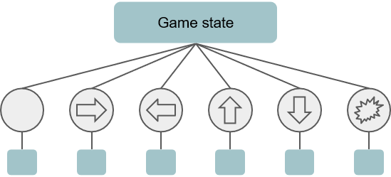

.. _implement_cpp_osla:

.. role:: cpp(code)
   :language: c++

################################
Implementing One Step Look Ahead (C++)
################################

This page shows how to implement an agent (One Step Look Ahead; OSLA) that uses the following components required for Statistical Forward Planning agents (i.e. Monte
Carlo Tree Search and Rolling Horizon Evolutionary Algorithms). In particular, OSLA uses:

#. Copies of a game state.
#. Advancing the game state forward with an action.
#. Evaluating a state with a heuristic function. 

The idea behind One Step Look Ahead is simple: given the current state and the list of all possible N actions that can be run from that point, OSLA tries all actions to
reach the respective N next states:

Each one of the subsequent states is then evaluated to obtained a (numerical) value of its quality. The objective is to identify which is the best state found according to
a heuristic / evaluation of the features of the state. Finally, the action that led to state with the highest value is returned to the game to be played next.

In order to implement this agent, first we setup the agent as indicated at the start of the :ref:`Implementing Simple AI Agents (C++) <implement_cpp_agent>` tutorial (this is: generate
a class that inherits from "Agent", override the *computeAction* function and finally register the agent in the AgentFactory::getDefaultFactory() method to be able to test it.

The first step to implement OSLA is (in *computeAction*) to compute all available actions from the current state. The tools to do this are passed by parameter to the 
*computeAction* method: the GameState and the ForwardModel objects. The function *generateActions* in ForwardModel can be used as indicated in the following
snippet, which also runs through all actions in the returned list:

.. code-block:: c++

    #include <Stratega/Agent/DoNothing/MyAgent.h>
    namespace SGA
    {
        ActionAssignment MyAgent::computeAction(GameState state, const ForwardModel& forwardModel, long timeBudgetMs)
        {
            std::vector<Action> actionSpace = forwardModel.generateActions(state, getPlayerID());
            for (int i = 0; i < actionSpace.size(); i++)
            {
            }
        }
    }

*generateActions* also receives a player ID, the one from the player for whom actions must be generated. The ID of the current player can be obtained by using "getPlayerID()",
as described in the :ref:`Agents and Game States <agent_game_states>` section.

The next step is to advance the state with each one of these actions.  The ForwardModel *advanceGameState* function receives a game state object and an action. This 
function executes that action in the game state received, **modifying** the game state that is passed by parameter. Given that we can only *advance* the state (and not 
go *back*), we also need to make a copy of the current state, for each new action we want to try. Copying a game state is simple, as we can just the *copy constructor* of C++.

The following two lines create a copy of the object "state", named "gsCopy", and passes it to the forward model to advance it with an action:

.. code-block:: c++

    GameState gsCopy(state);
    forwardModel.advanceGameState(gsCopy, actionSpace.at(i));

The next step would be to evaluate the state once it has been advanced with an action. We can do this with any function we consider appropriate. Let's assume we use the following
which rewards states with a short average distance between the player's entities and the opponent's:

.. code-block:: c++

    double evaluateState(GameState& state, int playerID)
    {
        double score = 0.0;
        std::vector<Entity*> opponentEntites = state.getNonPlayerEntities(playerID);
        std::vector<Entity*> playerEntities = state.getPlayerEntities(playerID);

        //It also provides high rewards for winning the game, low for losing it.
        if (state.isGameOver && state.winnerPlayerID == playerID) score = 1000;
        else if (state.isGameOver && state.winnerPlayerID != playerID) score = -1000;

        double sumOfAverageDistances = 0;
        for (const auto& p : playerEntities)
        {
            double sumOfDistances = 0;
            for (const auto& o : opponentEntites)
                sumOfDistances += abs(p->position.x - o->position.x) + abs(p->position.y - o->position.y);

            sumOfAverageDistances = sumOfDistances / opponentEntites.size();
        }
        score += sumOfAverageDistances / playerEntities.size();

        return -score;
    }

and we can use this function after advancing the game state:

.. code-block:: c++

    GameState gsCopy(state);
    forwardModel.advanceGameState(gsCopy, actionSpace.at(i));
    double value = evaluateState(gsCopy, getPlayerID());

The only thing missing now is to include the logic that keeps a reference to the action with the highest evaluation score, and returns it at the end. The complete 
*computeAction* function would look as follows:

.. code-block:: c++

    ActionAssignment MyAgent::computeAction(GameState state, const ForwardModel& forwardModel, long timeBudgetMs)
    {
        std::vector<Action> actionSpace = forwardModel.generateActions(state, getPlayerID());

        int bestActionIndex = 0;
        double bestHeuristicValue = -std::numeric_limits<double>::max();
        for (int i = 0; i < actionSpace.size(); i++)
        {
            GameState gsCopy(state);
            forwardModel.advanceGameState(gsCopy, actionSpace.at(i));
            double value = evaluateState(gsCopy, getPlayerID());
            if (value > bestHeuristicValue)
            {
                bestHeuristicValue = value;
                bestActionIndex = i;
            }
        }

        return ActionAssignment::fromSingleAction(actionSpace.at(bestActionIndex));
    }

Of course, this agent is not very strong as the heuristic function does not consider the complexities of a full strategy game - hence more
carefully thought evaluation functions may certainly be needed. Additionally, one step further may not be sufficient to allow for the actions
to make a bigger impact in the game, so OSLA's look ahead is clearly short-sighted. This tutorial only shows the basic components of these
agents, which are just enough to build more complex agents such Monte Carlo Tree Search, Rolling Horizon Evolutionary Algorithms or Portfolio 
methods.

